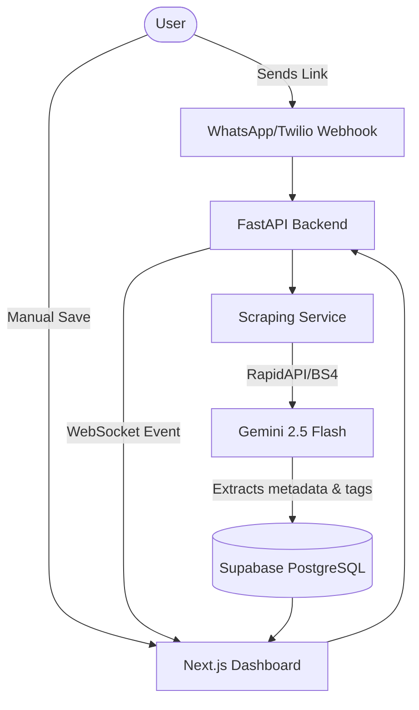

# Social Saver 🔖

**An AI-powered "Sync-to-Knowledge" pipeline** — send any link via WhatsApp or manually on the web, get it automatically scraped, categorized by AI, and displayed in a beautiful discovery dashboard.

---

## � Walkthrough Video


> *If the video doesn't play automatically, download `walkthrough.webp` or view it in a compatible browser.*

---

## 🔗 Submission Links

- **GitHub Repository**: [YOUR_GITHUB_REPO_LINK_HERE]

---

## 🏗️ System Schematics & Architecture

The system utilizes an event-driven architecture to process web content through AI effortlessly.



See `docs/architecture.md` for a more detailed technical breakdown.

---

## 💻 Technical Write-up

### Overview
Social Saver is a full-stack Next.js and FastAPI application designed to end the "link graveyard" problem. Whenever you encounter an interesting article, Twitter thread, or Instagram Reel, you simply send the link to a WhatsApp bot or paste it into the UI. An asynchronous backend Python worker automatically scrapes the URL, uses Google's latest `gemini-2.5-flash` model to synthesize a summary, and assigns dynamic categories and tags. 

### Core Components
1. **Frontend (Next.js 14 & Tailwind CSS)**
   - **Masonry Layout:** A bespoke, dynamic grid rendering distinct UI cards natively tailored for Instagram, Twitter, and generic Web articles.
   - **Real-time UX:** Utilizes WebSockets to push processed AI summaries the second they are ready, turning loading spinners into beautiful synthesized cards instantly.
   - **Client-Side Search:** Implements Fuse.js for fuzzy searching across categories, AI summaries, titles, and generated tags.
   
2. **Backend (FastAPI & Python 3.11)**
   - **Webhook & Extraction Pipeline:** Handles incoming messages from Twilio Sandbox / Meta Graph API. Validates, sanitizes, and matches Regex patterns for specific platforms.
   - **Multi-Service Scraper:** Integrates `newspaper3k` for raw web articles and custom `RapidAPI` endpoints to bypass Instagram login walls to scrape Reel captions and metadata.
   - **AI Synthesizer:** Sends the raw heavy-text to Google Gemini with a highly specific System Prompt enforcing strict JSON outputs (`title`, `summary`, `category`, `tags`).
   - **Export & Serendipity:** Offers an `/export/markdown` route to backup data and a `/links/roulette` endpoint to resurface "forgotten gems".

3. **Data Layer (Supabase)**
   - Houses the PostgreSQL engine representing the primary source of truth.
   - Fast retrieval mappings for the React dashboard.

---

## 🚀 Quick Start

### Prerequisites
- Node.js 20+
- Python 3.11+
- [Supabase](https://supabase.com) project
- [Twilio](https://twilio.com) or [Meta](https://developers.facebook.com) account
- [Gemini API key](https://aistudio.google.com)

### 1. Clone & Configure
```bash
git clone <your-repo-url>
cd HackTheThread
cp .env.example .env
# Edit .env and fill in your API keys
```

### 2. Set Up Database
Run the schema initialization found in `backend/db/supabase_client.py` inside your Supabase SQL Editor.

### 3. Run with Docker (Recommended)
```bash
docker-compose up --build
```
- **Frontend** → [http://localhost:3000](http://localhost:3000)
- **Backend / API Docs** → [http://localhost:8000/docs](http://localhost:8000/docs)

### 4. Run Locally (Dev Mode)
**Backend:**
```bash
cd backend
python -m venv .venv
source .venv/bin/activate
pip install -r requirements.txt
uvicorn main:app --reload --port 8000
```

**Frontend:**
```bash
cd frontend
npm install
npm run dev
```

---

## 📁 Repository Structure

- `/backend` - FastAPI Python server, endpoints, scraping logic, AI synthesis, and WebSocket managers.
- `/frontend` - Next.js React client, Tailwind styling, masonry components, and interactive tools.
- `/docs` - Extra API specifications and larger architectural diagrams.
- `walkthrough.webp` - Video recording demonstrating the functionality.
