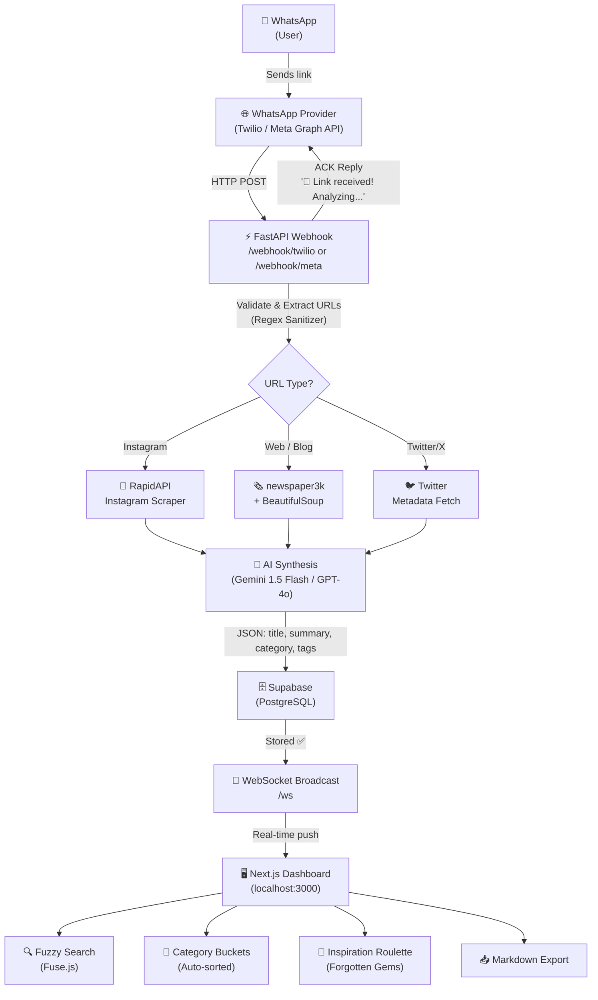

# System Architecture — Social Saver

## Pipeline Overview



## Component Breakdown

| Component | Technology | Purpose |
|---|---|---|
| Webhook Receiver | FastAPI | Receives & ACKs WhatsApp messages |
| URL Sanitizer | Python regex | Classifies & cleans Instagram, Twitter, web URLs |
| Instagram Scraper | RapidAPI | Extracts caption, thumbnail, author |
| Web Scraper | newspaper3k + BS4 | Extracts readable text from blogs/articles |
| AI Orchestrator | Gemini 1.5 Flash | Returns `{title, summary, category, tags}` JSON |
| Database | Supabase (PostgreSQL) | Persists all saved links |
| WebSocket Server | FastAPI WS | Broadcasts real-time updates to dashboard |
| Dashboard | Next.js 14 + Tailwind | Masonry grid, search, filters, roulette, export |
| Search | Fuse.js | Client-side fuzzy search across all fields |

## Data Flow — Single Link

```
1. User sends "https://www.instagram.com/reel/ABC123/"
2. Webhook receives → extracts URL → detects Instagram
3. ACK sent: "🔗 Link received! Analyzing the vibe... ✨"
4. Background task: RapidAPI scrape → {caption, thumbnail, author}
5. Gemini synthesizes → {title, summary, category: "Fitness", tags: ["workout", "gym"]}
6. Saved to Supabase
7. WebSocket broadcasts to dashboard → card appears instantly
8. WhatsApp reply: "✅ Gym Motivation Reel\n📂 Fitness | 🏷️ workout, gym, motivation"
```
